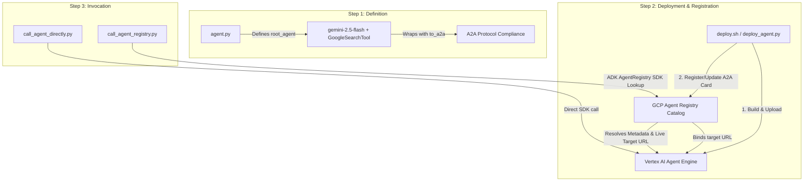

# 🤖 Google Search ADK Agent: Building, Deploying, & Calling Guide

This directory contains the core pipeline for defining an **ADK Agent**, deploying it to **Vertex AI Agent Engine**, publishing its **A2A Agent Card** to **GCP Agent Registry**, and executing queries against it **directly** or via **ADK AgentRegistry Client API**.

---

## 🏗️ Architecture & Workflow Overview



---

## 📂 File Structure & Descriptions

| File Name | Role & Description |
| :--- | :--- |
| **[`agent.py`](file:///Users/hangsik/Documents/Antigravity/agentplatform/agent_gateway/build_agent/agent.py)** | Defines the ADK Agent (`search_agent_0805`) configured with `gemini-2.5-flash` and `GoogleSearchTool`, plus an A2A protocol wrapper (`to_a2a`). |
| **[`deploy_agent.py`](file:///Users/hangsik/Documents/Antigravity/agentplatform/agent_gateway/build_agent/deploy_agent.py)** | Complete Python deployment pipeline: loads ADK agent, builds Vertex AI `AgentEngine`, and registers/updates A2A Agent Card in GCP Agent Registry. |
| **[`deploy.sh`](file:///Users/hangsik/Documents/Antigravity/agentplatform/agent_gateway/build_agent/deploy.sh)** | Executable Bash wrapper script setting environment variables (`PROJECT_ID`, `LOCATION`, `STAGING_BUCKET`, `DISPLAY_NAME`) and executing `deploy_agent.py`. |
| **[`call_agent_directly.py`](file:///Users/hangsik/Documents/Antigravity/agentplatform/agent_gateway/build_agent/call_agent_directly.py)** | Direct client caller using Vertex AI SDK (`vertexai.agent_engines.list()`). Locates `Search_Agent-0805`, creates a session, and streams responses. |
| **[`call_agent_registry.py`](file:///Users/hangsik/Documents/Antigravity/agentplatform/agent_gateway/build_agent/call_agent_registry.py)** | Client caller using ADK SDK (`AgentRegistry`). Searches GCP Agent Registry for `Search_Agent-0805`, resolves live Target URL (`get_agent_info`), and calls the agent. |

---

## 🚀 Step-by-Step Usage Guide

### 1. Define the Agent (`agent.py`)
The agent is created using ADK `Agent` and wrapped for A2A protocol compliance:
```python
root_agent = Agent(
    model='gemini-2.5-flash',
    name='search_agent_0805',
    description='An agent that searches and analyzes user requests using Google Search.',
    instruction="Search for and analyze the user's request using Google Search.",
    tools=[google_search],
)

a2a_app = to_a2a(root_agent)
```

---

### 2. Deploy to Vertex AI Agent Engine & Register (`deploy.sh`)
Execute `deploy.sh` to build the remote Reasoning Engine and update GCP Agent Registry.

```bash
bash agent_gateway/build_agent/deploy.sh
```

**Pipeline Steps:**
1. **Step 1**: Loads `root_agent` and verifies tool/A2A setup.
2. **Step 2**: Creates/replaces the remote `AgentEngine` on Vertex AI (`projects/ai-hangsik/locations/us-central1/reasoningEngines/...`).
3. **Step 3**: Publishes/updates the **A2A Agent Card** (`type: A2A_AGENT_CARD`, `protocolVersion: 0.3.0`) in GCP Agent Registry with the **new live Target URL**.

> [!IMPORTANT]
> **Why Step 3 is critical**: Redeploying creates a new `ReasoningEngine` resource ID. Step 3 updates GCP Agent Registry to point to the new live resource URL. Without Step 3, Agent Registry callers would fetch the old deleted URL and fail with `404 The ReasoningEngine does not exist`.

---

### 3. Invoking the Deployed Agent

#### Option A: Direct Calling (`call_agent_directly.py`)
Call the Agent Engine directly via Vertex AI SDK:

```bash
python3 agent_gateway/build_agent/call_agent_directly.py "Google의 최근 발표된 Gemini AI 최신 모델 및 핵심 기능 요약해줘."
```

- **Mechanism**: Lists live Reasoning Engines (`vertexai.agent_engines.list()`), creates a user session, and streams grounded search responses.

---

#### Option B: Discovery & Calling via GCP Agent Registry (`call_agent_registry.py`)
Perform dynamic service discovery via ADK `AgentRegistry` SDK:

```bash
python3 agent_gateway/build_agent/call_agent_registry.py "Google의 최근 발표된 Gemini AI 최신 모델 및 핵심 기능 요약해줘."
```

- **Mechanism**:
  1. Initializes `registry = AgentRegistry(project_id="ai-hangsik", location="global")`.
  2. Searches registry catalog (`registry.list_agents()`).
  3. Resolves A2A Agent Card metadata and live Target URL (`registry.get_agent_info()`).
  4. Connects to the resolved Vertex AI Agent Engine instance and streams responses.

---

## 🔑 Key Concepts & Summary

1. **A2A Protocol Compliance**: The agent is wrapped with `to_a2a(...)` and registered as an A2A Agent Card (`A2A_AGENT_CARD`), allowing peer agents and ADK clients (`RemoteA2aAgent`) to discover and communicate with it.
2. **Dynamic Target URL Sync**: Step 3 in `deploy_agent.py` ensures that Agent Registry metadata is synchronized with the latest deployed Vertex AI Reasoning Engine instance.
3. **Real-time Web Grounding**: Uses `GoogleSearchTool` to perform live Google searches before generating formatted markdown responses.
